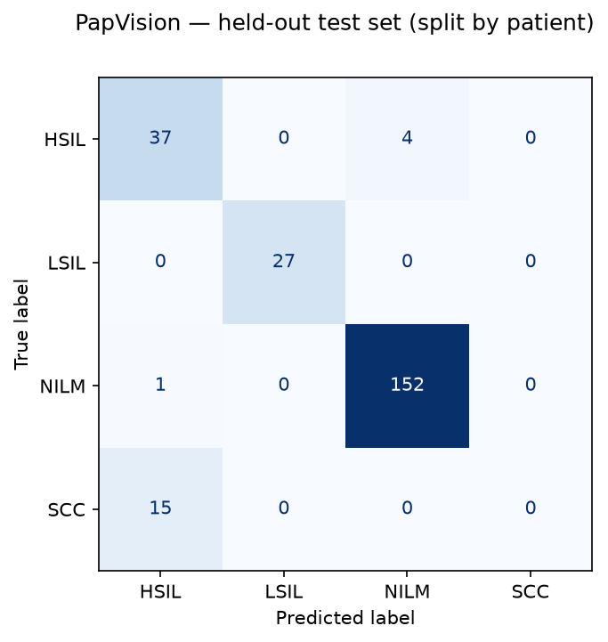

# PapVision

A cervical cytology image classifier served as a small Flask web app, and an
honest account of why it doesn't work.

**Status: v0.2 — retrained, evaluated, cross-validated, and documented.** The
model is reproducible from `train.py` against a cited dataset, with a published
confusion matrix, per-class metrics, and 4-fold slide-grouped cross-validation.

Three things came out of that, and none of them flatter the model:

1. A logistic regression on **six colour numbers** matches the CNN, and beats it
   on balanced accuracy and carcinoma recall.
2. The model **essentially cannot detect squamous cell carcinoma** — mean recall
   0.153 across folds, 0.00 on the shipped split.
3. Fold-to-fold variance is so large that any single-split number from this
   dataset, including the one this repo ships, is untrustworthy alone.

Those results are the point of this repository.

---

## ⚠️ Not a medical device

**This project is for research and educational purposes only.**

- It is **not** a diagnostic tool, and it is **not** cleared or approved by any regulatory body (FDA, CDSCO, CE, or otherwise).
- It must **not** be used to make, support, or influence any clinical decision.
- Predictions are **not** a substitute for examination by a qualified cytopathologist.
- It has **not** been validated on real-world clinical slides, across scanners, staining protocols, or patient populations.

If you have a health concern, talk to a doctor. Do not upload your own medical images here expecting a meaningful answer.

This notice is also rendered at the top of the web UI and repeated beside every prediction.

---

## The headline result

**Six numbers beat the neural network.**

Each image reduced to its per-channel RGB mean and standard deviation — no
cells, no nuclei, no texture, no spatial information of any kind — then a
logistic regression on those six numbers. Evaluated with the same slide-grouped
4-fold cross-validation as the CNN:

| Metric | 6-number colour baseline | Fine-tuned MobileNetV3 |
|---|---:|---:|
| Accuracy | 0.779 | **0.849** |
| Balanced accuracy | **0.748** | 0.689 |
| Macro-F1 | 0.627 | **0.663** |
| **SCC recall** | **0.435** | 0.153 |

The baseline wins on balanced accuracy and gets nearly **three times** the
carcinoma recall. The CNN's only clear win is raw accuracy, which is dominated
by NILM at 64% of the data.

A model that cannot see a single cell should not be competitive with one trained
to classify cytology. That it is means most of the separability in this dataset
is **staining and illumination**, not pathology — a property of when and how each
slide was scanned rather than of the patient it came from.

Reproduce with `python baseline.py --data-dir data/`. This is the check that
should be run before any deep model on a dataset like this is believed, and it
takes about thirty seconds.

---

## The second result: how a leaky split lies

The same architecture, the same hyperparameters, the same seed. The only
difference is how the train/test split was drawn.

| Metric | Split by **slide** | Split by **image** | Inflation |
|---|---:|---:|---:|
| Accuracy | 0.915 | 0.975 | +0.060 |
| Balanced accuracy | 0.724 | 0.947 | +0.223 |
| Macro-F1 | 0.693 | 0.950 | +0.257 |
| **SCC recall** | **0.00** | **0.89** | **+0.89** |

Mendeley LBC contains 962 images taken from only **61 slides** — roughly 16
images per slide. Split those images randomly and the same slide lands on both
sides of the boundary, so the model only has to recognise a slide's staining and
illumination signature rather than its pathology.

Do that, and you get a model that appears to detect carcinoma nine times out of
ten. Split by slide instead, and on this split it detects carcinoma **zero**
times out of fifteen — cross-validated across every slide, 0.15. Both numbers
came from the same code, minutes apart.

Published work on this dataset routinely reports accuracy in the high nineties.

---

## What the honest model actually does

Overall accuracy is 0.915, which tells you almost nothing.

| Class | Precision | Recall | F1 | Test images | Test slides |
|---|---:|---:|---:|---:|---:|
| HSIL | 0.70 | 0.90 | 0.79 | 41 | 3 |
| LSIL | 1.00 | 1.00 | 1.00 | 27 | 1 |
| NILM | 0.97 | 0.99 | 0.98 | 153 | 12 |
| **SCC** | **0.00** | **0.00** | **0.00** | 15 | 1 |



Every one of the 15 carcinoma images was classified as HSIL. Not one was
predicted SCC. Four HSIL images were called NILM — high-grade lesions read as
normal, the other severe error in a screening context.

Feeding a held-out SCC image to the running app returns **`HSIL` at 90.67%
confidence**, clearing the 0.90 threshold that is supposed to make it decline.
The gate does not catch this, because the model is not uncertain — it is
confidently wrong.

LSIL's perfect score is not good news either: all 27 LSIL test images come from
a single slide, so the model may have learnt that slide rather than low-grade
lesion morphology. Nothing in this dataset can distinguish those.

### But one split is not enough to say that

Every number above rests on a single held-out slide per rare class. To check
whether they are real or an accident of which slide landed in test, every slide
was rotated through the test fold — 4-fold, grouped by slide:

| Class | Mean recall | Min | Max | Per-fold |
|---|---:|---:|---:|---|
| HSIL | 0.758 | 0.39 | 1.00 | 0.81 · 0.39 · 1.00 · 0.83 |
| LSIL | 0.890 | 0.59 | 1.00 | 0.59 · 0.96 · 1.00 · 1.00 |
| NILM | 0.956 | 0.84 | 1.00 | 1.00 · 1.00 · 0.84 · 0.99 |
| **SCC** | **0.153** | **0.00** | **0.55** | 0.00 · 0.00 · 0.07 · 0.55 |

Accuracy 0.849 (0.808–0.937) · balanced accuracy 0.689 (0.590–0.840) · macro-F1
0.663 (0.581–0.834).

This changes two things. **SCC is not reliably 0.00** — one fold reached 0.55, so
the shipped split's zero is the worst case rather than the universal one. Mean
0.15 is still a model that misses roughly six carcinoma fields in seven.

More importantly, **the spread is enormous**. HSIL recall ranges from 0.39 to
1.00 depending only on which slides were held out. Macro-F1 moves by 0.25. With
4 slides in the rare classes and 61 overall, a single split on this dataset
measures the split as much as the model — which means published single-split
results on it, including the one this repo ships, are not trustworthy on their
own.

*Protocol note:* the cross-validation trains on train/test folds only, so it
uses the final epoch rather than selecting a checkpoint on validation macro-F1
the way the shipped single split does. Some of the spread may be checkpoint
selection rather than the split. The magnitude of the variance is not in doubt;
its precise attribution is.

Full detail in [MODEL_CARD.md](MODEL_CARD.md); dataset audit in [DATASET.md](DATASET.md).

---

## What it does

1. You upload an image of a cervical cytology (Pap smear) field.
2. The upload is checked against an extension allowlist and then actually decoded, so a file that merely claims to be an image is rejected.
3. The image is resized to 224×224 and normalised with ImageNet statistics.
4. A fine-tuned MobileNetV3-Small produces logits over four classes.
5. Softmax is applied; if the top score falls below 0.90, the app declines to name a class.
6. Otherwise the predicted class is returned, along with the score for **all four** classes.

Uploads are held in memory for the lifetime of the request and never written to disk. The preview in the UI is a downscaled copy embedded as a data URI.

### Classes

| Label | Meaning |
|-------|---------|
| `NILM` | Negative for intraepithelial lesion or malignancy |
| `LSIL` | Low-grade squamous intraepithelial lesion |
| `HSIL` | High-grade squamous intraepithelial lesion |
| `SCC`  | Squamous cell carcinoma |

The class order baked into the checkpoint is `["HSIL", "LSIL", "NILM", "SCC"]`,
set by `preprocessing.CLASS_NAMES` and used by `train.py`, so serving and
training cannot disagree about it.

---

## Architecture

```
browser / client
      │  multipart image upload
      ▼
Flask app  (app.py)
      │
      ├── "/"         → HTML page, renders prediction inline
      ├── "/predict"  → JSON API
      └── "/health"   → liveness probe
      │
      ▼
read_upload()                    classify()
      │                                │
      ├── extension allowlist          ├── Resize(224) → ToTensor → Normalize
      ├── Pillow verify + decode       ├── MobileNetV3-Small, final Linear → 4
      └── RGB convert                  ├── softmax → per-class breakdown
                                       └── raise LowConfidence if top < 0.90
```

The model loads once at import onto CPU in `eval()` mode. There is no GPU path at inference — intentional, for cheap deployment. The web UI contains no JavaScript; it is a plain form POST and the CSP blocks scripts entirely.

---

## Project structure

```
app.py                Flask routes, model loading, upload validation, inference
preprocessing.py      Transforms and class names shared by training and serving
splitting.py          Leakage-safe, stratified, slide-grouped dataset splitting
inspect_dataset.py    Pre-flight check: can slides be recovered from filenames?
cross_validate.py     Slide-grouped k-fold, because one split is not a measurement
baseline.py           Six-number colour baseline — what the CNN has to beat
train.py              Fine-tuning pipeline; writes metrics and a confusion matrix
cervical_model.pth    Trained weights (v0.2, reproducible from train.py)
DATASET.md            Dataset audit, including corrections to its published description
MODEL_CARD.md         Intended use, metrics, failure modes
requirements.txt      Pinned runtime dependencies, CPU-only PyTorch wheels
requirements-train.txt Training-only extras (scikit-learn, matplotlib, numpy)
docs/
  confusion_matrix.png            slide-grouped split — the honest one
  confusion_matrix_leaky_split.png  by-image split, for comparison
  metrics.json, metrics_leaky_split.json, cv_metrics.json
  baseline_metrics.json, baseline_metrics_binary.json
templates/index.html  Upload form, disclaimer, result display
tests/                64 tests: upload handling, preprocessing, splitting, pattern ranking
.github/workflows/ci.yml   Lint and test on every push
```

`preprocessing.py` exists so training and serving cannot drift. If the two applied different resizing or normalisation the model would still run and still answer confidently — it would just be quietly wrong.

---

## Running it locally

```bash
git clone https://github.com/SamGabriel-Here/pap-vision.git
cd pap-vision

python3 -m venv .venv
source .venv/bin/activate        # Windows: .venv\Scripts\activate

pip install -r requirements.txt
python app.py
```

Open <http://localhost:8080>.

```bash
pip install pytest ruff
pytest && ruff check .
```

For a production-ish run: `gunicorn -w 2 -b 0.0.0.0:8080 app:app` — each worker loads its own copy of the model.

### Running it with Docker

```bash
docker build -t papvision .
docker run -d -p 8080:8080 --name papvision papvision
curl http://localhost:8080/health
```

The image installs `requirements.txt` only (no training dependencies), runs
`gunicorn` with 2 workers as an unprivileged `papvision` user, and exposes a
Docker `HEALTHCHECK` against `/health`. Built and run locally against this
checkpoint: `docker build` succeeds, `/health` returns `200`, and `/predict`
returns real inference output from inside the container.

### Configuration

| Variable | Default | Purpose |
|---|---|---|
| `PAPVISION_ALLOWED_ORIGINS` | `http://localhost:8080` | Comma-separated CORS allowlist for `/predict` |

Uploads are capped at 8 MB (`MAX_CONTENT_LENGTH`).

---

## Reproducing the model

Download [Mendeley LBC](https://data.mendeley.com/datasets/zddtpgzv63/4) (CC BY 4.0, 2.23 GB) into one folder per class named `HSIL/ LSIL/ NILM/ SCC/`. The published folders use long descriptive names and the filenames look like `NL_10_ (5).jpg` — see [DATASET.md](DATASET.md).

Check the slide structure before training. This needs only the standard library:

```bash
python inspect_dataset.py --data-dir data/
```

It reports which filename patterns recover a slide id and prints the exact `train.py` command — or tells you no grouping is possible and what to do instead.

```bash
pip install -r requirements-train.txt
python train.py --data-dir data/ --dry-run          # read the split first
python train.py --data-dir data/ --test-size 0.25 --val-size 0.10 --epochs 25
```

Training refuses to start unless it recovers a slide id from at least 95% of filenames. **Read the split summary rather than trusting it** — a leaked split does not crash, it quietly inflates everything downstream.

To reproduce the leaky comparison, add `--group-by image`. That flag prints a warning and stamps `leakage_warning` into `docs/metrics.json`, so those numbers can never be quoted as clean.

Outputs: `cervical_model.pth`, `docs/confusion_matrix.png`, `docs/metrics.json`.

---

## API

### `POST /predict`

`multipart/form-data` with a single `file` field. Allowed: `.png`, `.jpg`, `.jpeg`, `.bmp`, `.tif`, `.tiff`.

```bash
curl -F "file=@sample.png" http://localhost:8080/predict
```

**200**

```json
{
  "prediction": "HSIL",
  "confidence": 90.67,
  "softmax_score": 90.67,
  "probabilities": { "HSIL": 90.67, "LSIL": 0.09, "NILM": 7.23, "SCC": 2.01 }
}
```

`confidence` (kept for backward compatibility), `softmax_score`, and the values in `probabilities` are softmax scores as percentages. They are **not** probabilities that the answer is correct. The example above is a real response to a held-out **SCC** image.

**400** — `No file uploaded`, `No image selected`, `Unsupported file type`, `Uploaded file is empty`, `Uploaded file is not a valid image`, `Low confidence, please upload a clearer image` (with `probabilities`).

**413** — `Image is larger than 8 MB`.

### `GET /health`

```json
{ "status": "ok", "classes": ["HSIL", "LSIL", "NILM", "SCC"] }
```

---

## Known limitations

**Model and evaluation**

- **No SCC recall at all.** Zero of 15 held-out carcinoma images identified. This is a total failure on the class that matters most.
- **Trained on 2 SCC slides and 2 LSIL slides.** Four slides exist per class in the entire dataset. No methodology fixes a sample that small; the LSIL and SCC numbers are anecdotes with error bars spanning most of the unit interval.
- **61 slides, not 460 patients.** The paper's patient count is widely repeated as though the images were independent. They are not. See [DATASET.md](DATASET.md).
- **Softmax confidence is not calibrated.** No temperature scaling. A held-out SCC image returns HSIL at 90.67%.
- **The 0.90 gate does not catch the failures.** It catches uncertainty, and this model is confidently wrong rather than uncertain.
- **No out-of-distribution rejection.** Uniform random noise maps into a pathology class with high confidence.
- **Single-field.** Real screening reviews a whole slide; this classifies one cropped field.
- **Unknown generalisation.** One institution, one microscope, one staining protocol.

**Engineering**

- No rate limiting on `/predict`.
- The checkpoint is committed to git rather than stored as a release asset.
- Each gunicorn worker loads its own copy of the model; no batching.
- No structured request logging or latency metrics.

---

## Roadmap

### v0.2 — Retrain from a documented dataset ✅

- [x] Document the dataset, its source, its licence, and its real class distribution
- [x] Split by **slide**, not by image, and stratify by class
- [x] Assert no slide appears in more than one split
- [x] Handle class imbalance via inverse-frequency weighting; select on macro-F1
- [x] Publish a confusion matrix and per-class precision, recall, F1
- [x] Report macro-F1 and balanced accuracy alongside raw accuracy
- [x] Quantify what a leaky split would have claimed instead
- [x] Cross-validate, grouped by slide, so the headline doesn't rest on one held-out slide
- [x] `MODEL_CARD.md`

### v0.3 — Harden the service ✅

- [x] Extension allowlist plus real decoding; uploads never touch disk
- [x] `MAX_CONTENT_LENGTH` with a friendly 413 on both paths
- [x] Locked-down CSP, `X-Content-Type-Options`, `Referrer-Policy`
- [x] CORS narrowed to a configurable allowlist
- [x] `torch.load(..., weights_only=True)`; no bare `except:`
- [x] Pinned dependencies on the CPU-only PyTorch wheel index
- [ ] Basic rate limiting on `/predict`

### v0.4 — Show the model's reasoning

- [x] Trivial colour baseline, to establish what the CNN actually adds (answer: very little)
- [ ] Grad-CAM overlay alongside every prediction — start with the SCC images it calls HSIL
- [ ] Stain normalisation (Macenko or Reinhard), then re-run both baseline and CNN. If the colour baseline collapses and the CNN holds, the CNN was learning morphology after all. If both collapse, this dataset cannot support the task
- [ ] Side-by-side input and heatmap in the web UI
- [ ] README gallery of the model attending to nuclei vs staining artifacts

### v0.5 — Honest confidence

- [ ] Temperature scaling fitted on the validation slides
- [ ] Reliability diagram and expected calibration error
- [ ] Threshold from a precision/recall sweep rather than hardcoded
- [ ] Out-of-distribution detection as a separate gate from softmax confidence
- [x] Full per-class score breakdown in the API response
- [x] Prominent in-app disclaimer on the result itself

### v0.6 — Deployment and reproducibility

- [ ] Dockerfile and `docker-compose.yml`
- [x] GitHub Actions running lint and tests on push
- [x] Unit tests for preprocessing, the confidence gate, and both error paths
- [ ] Move `cervical_model.pth` to a release asset
- [x] `/health` endpoint

### v1.0 — Beyond a single field

- [ ] **More SCC and LSIL slides from other sources** — the binding constraint on everything else
- [ ] Collapse to the question this data can actually answer: NILM vs abnormal is 43 slides against 18, and it is the clinically meaningful screening call
- [ ] Whole-slide input with tiling and slide-level aggregation
- [ ] Compare against a stronger backbone and report the accuracy/latency tradeoff

### Deliberately out of scope

- Any claim of clinical validity
- Any deployment intended for real patient care
- Storing uploaded images beyond the lifetime of a request

---

## Contributing

Issues and pull requests welcome, particularly around evaluation methodology and dataset documentation. Please don't open issues asking for clinical interpretation of an image.

## Acknowledgements

- Hussain, Elima (2019), "Liquid based cytology pap smear images for multi-class diagnosis of cervical cancer", Mendeley Data, V4, [doi:10.17632/zddtpgzv63.4](https://doi.org/10.17632/zddtpgzv63.4), CC BY 4.0
- PyTorch and torchvision for MobileNetV3 and its pretrained weights
- The Bethesda System for cervical cytology terminology

## License

Code is MIT licensed — see [LICENSE](LICENSE). The training data is CC BY 4.0, which permits redistributing derived weights with attribution; that attribution is in [MODEL_CARD.md](MODEL_CARD.md).
